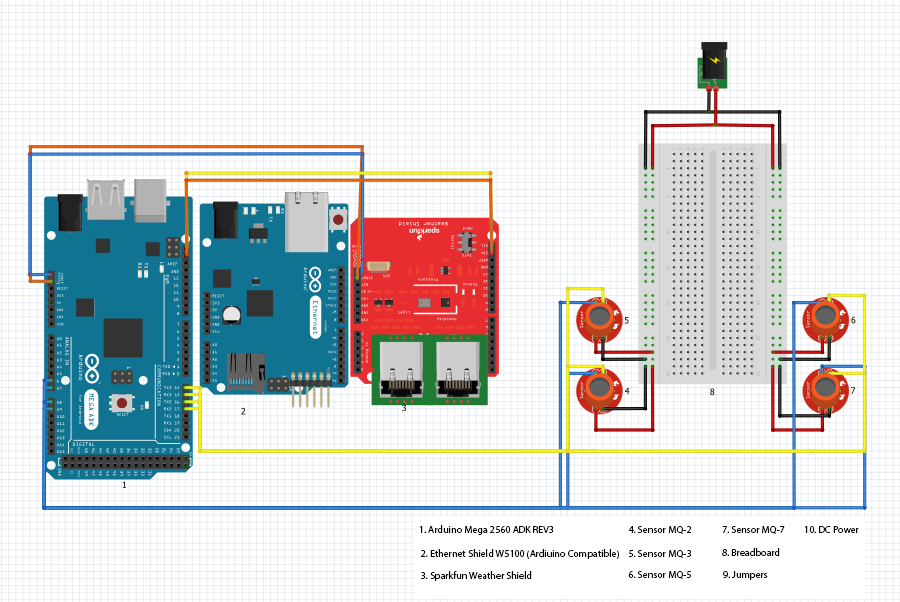

# Romilos-Weather-Station

## Description
This is a Weather Station that calculates temperature, humidity, wind speed, wind direction, heat index, atmospheric pressure, raining level and gas sensors such as MQ-2, MQ-3, MQ-5 and MQ-7. This Weather Station is dedicated on Romilos, a member of our IEEE Student branch who is not with us anymore.

## Development
The application used to develop the project was the Arduino IDE where we programmed the boards. We also used Fritzing to implement the design of Romilos Weather Station, tools that help in the design of the project. For the connection of Romilos on the Internet we used the Ubidots which is a web platform where we represent the sensor measurements with various diagrams.

## Tools needed
- 1 x Arduino Mega
- 1 x SparkFun Weather Shield
- 1 x Ethernet Shield
- 1 x Breadboard 
- 1 x MQ-2 Sensor
- 1 x MQ-3 Sensor
- 1 x MQ-5 Sensor
- 1 x MQ-7 Sensor
- 1 x USB cable
- 1 x Connector 

## Installation 
- Download the code.
- Open the Arduino IDE and load the code.
- Open the serial port monitor
(Optional) You can download Fritzing from http://fritzing.org/download/ to view the schematics

## Usage
- You can open the Schematic.fzz with Fritzing

## Project Status
The current project has reached its final version, which was held on 30 November, by the IEEE Student Branch Western Macedonia University of Applied Sciences, Kastoria.

## Schematic

